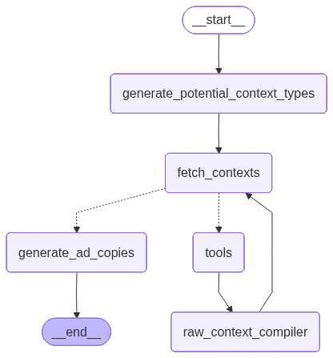

# Hyperlocal Contextual Ad Copy Generator

A **Streamlit-based application** that generates **hyperlocal, context-aware ad copies** using **LangGraph** and **Google Gemini** models.
Designed for marketers and developers who want to automate ad creative generation with geographic and contextual personalization.

---

## Live Deployment

The project is live [here](https://hyperlocal-contextual-ad-copy-generator.onrender.com)!

---

## Features

- **Graph-based reasoning** using LangGraph for modular prompt workflows.
- **Gemini-powered text generation** for creative and contextual ad copies.
- **Streamlit UI** for interactive ad generation and visualization.
- **Dynamic prompt templates** and modular nodes for easy customization.
- **Graph visualization** (`graph.png`) to illustrate workflow logic.

---

## Tech Stack

- **Frontend:** Streamlit
- **LLM Framework:** LangGraph
- **Model Backend:** Google Gemini
- **Language:** Python 3.10+

---

## Setup & Installation

1. **Clone the repository**

   ```bash
   git clone https://github.com/saksham1341/hyperlocal-contextual-ad-copy-generator.git
   cd hyperlocal-contextual-ad-copy-generator
   ```

2. **Create a virtual environment**

   ```bash
   python -m venv venv
   source venv/bin/activate   # On Windows: venv\Scripts\activate
   ```

3. **Install dependencies**

   ```bash
   pip install -r requirements.txt
   ```

4. **Configure environment variables**

   - Copy `.env.example` to `.env`
   - Add your Gemini API key and any other required credentials.

5. **Run the Streamlit app**

   ```bash
   streamlit run app.py
   ```

---

## Project Structure

```
.
├── app.py                 # Streamlit app entry point
├── graph.py               # LangGraph setup
├── config.py              # Config and environment management
├── src/
│   ├── models.py          # LLM integration
│   ├── nodes.py           # Graph nodes
│   ├── prompts.py         # Prompt templates
│   ├── schemas.py         # Data schemas
│   ├── state.py           # App state management
│   └── tools.py           # Helper utilities
├── requirements.txt       # Dependencies
├── .env.example           # Env variable sample
└── graph.png              # Graph visualization
```

---

## Graph Overview

The app’s logic is defined through LangGraph’s composable nodes.


---

## For Developers

- Modify or extend nodes in `src/nodes.py` to add new logical steps.
- Adjust prompts in `src/prompts.py` to fine-tune ad creativity.
- Integrate new APIs or tools via `src/tools.py`.
